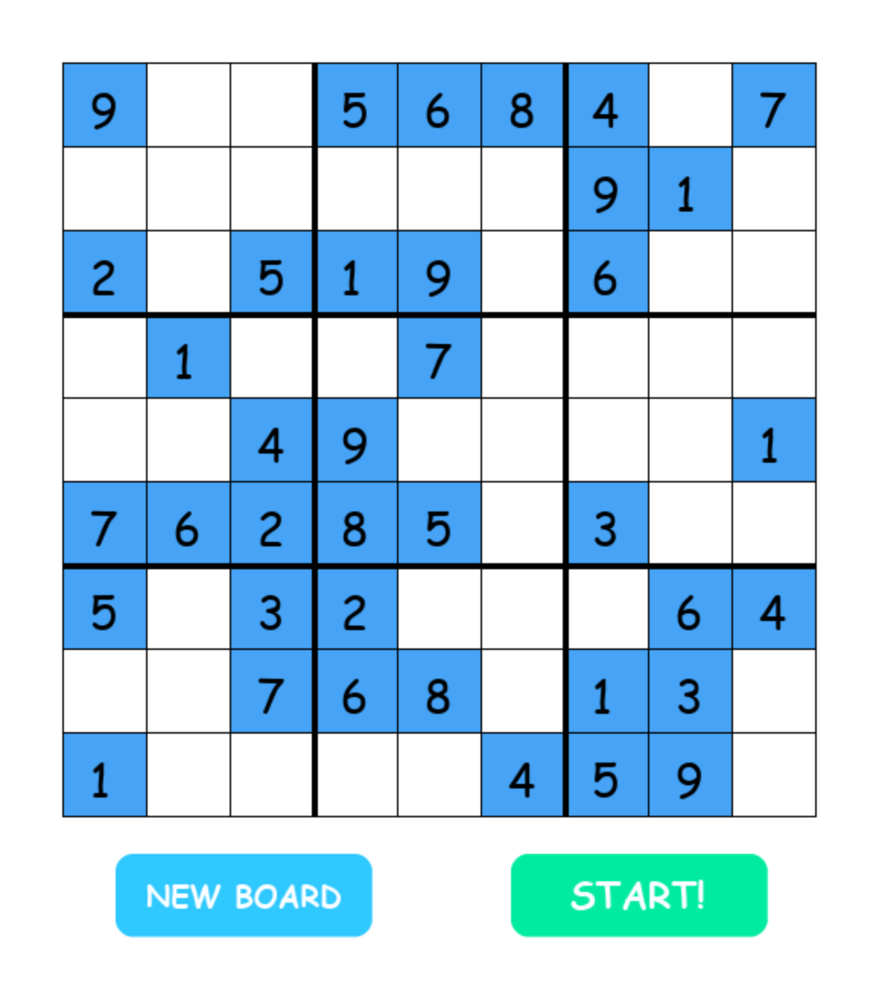

# sudoku_solver

This is sudoku self solver!

By running the main.py, the game will start.

data.py contain all the grids, if you want to add new board you can edit this file.
animate.py is the code for animation appear when it completely solve the puzzle.

Feel free to use and edit, since this is my first ever project it might not be perfect but it teach me a lot :)

